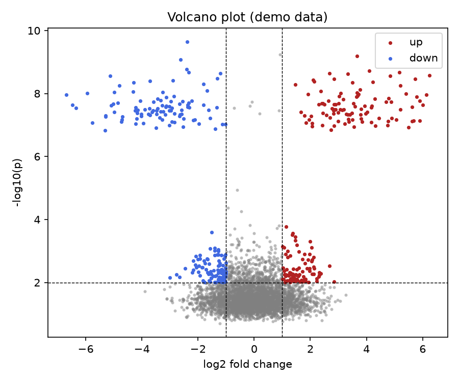

# Volcano Plot Toolkit

You ran a differential-expression analysis and got 20,000 genes with p-values and fold changes. Now what? A volcano plot turns that wall of numbers into a single glance: what changed, by how much, and how confidently.

## Why This Matters

Differential expression spits out thousands of rows, and nobody — not your collaborators, not a reviewer — reads a CSV that long. The volcano plot is the field's standard first look. It places effect size (log2 fold change) against confidence (-log10 p-value), so the genes that truly matter — big change *and* statistically solid — sit out in the top corners where you can't miss them.

## How It Works

1. Compute a log2 fold change and a p-value for every gene.
2. Transform p to -log10 so the most significant genes rise to the top.
3. Apply a threshold on both fold change and significance.
4. Colour the up- and down-regulated hits.

## What the Demo Shows



The demo simulates 4,000 genes with ~200 genuinely changed, then draws the volcano. Grey points are unchanged; red are significantly up-regulated, blue down-regulated. The two wings rising in the top corners are exactly the genes you would carry forward.

## Run It

```bash
pip install -r requirements.txt
python demo.py
```

> Demonstrated on synthetic data, so the whole thing is reproducible with no external downloads.
